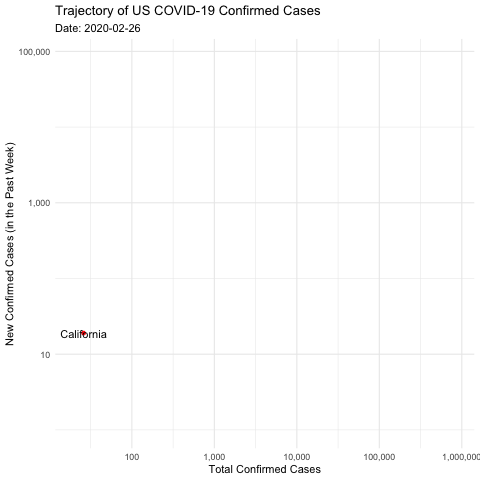
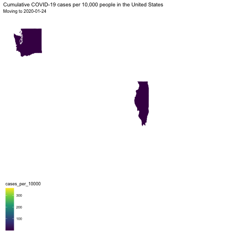

```r
library(tidyverse)     # for data cleaning and plotting
library(googlesheets4) # for reading googlesheet data
library(lubridate)     # for date manipulation
library(openintro)     # for the abbr2state() function
library(palmerpenguins)# for Palmer penguin data
library(maps)          # for map data
library(ggmap)         # for mapping points on maps
library(gplots)        # for col2hex() function
library(RColorBrewer)  # for color palettes
library(sf)            # for working with spatial data
library(leaflet)       # for highly customizable mapping
library(ggthemes)      # for more themes (including theme_map())
library(plotly)        # for the ggplotly() - basic interactivity
library(gganimate)     # for adding animation layers to ggplots
library(transformr)    # for "tweening" (gganimate)
library(shiny)  # for creating interactive apps
library(gifski)
library(ggridges)
library(ggimage)
gs4_deauth()           # To not have to authorize each time you knit.
theme_set(theme_minimal())
```


```r
# SNCF Train data
small_trains <- read_csv("https://raw.githubusercontent.com/rfordatascience/tidytuesday/master/data/2019/2019-02-26/small_trains.csv") 

# Lisa's garden data
garden_harvest <- read_sheet("https://docs.google.com/spreadsheets/d/1DekSazCzKqPS2jnGhKue7tLxRU3GVL1oxi-4bEM5IWw/edit?usp=sharing") %>% 
  mutate(date = ymd(date))

# Lisa's Mallorca cycling data
mallorca_bike_day7 <- read_csv("https://www.dropbox.com/s/zc6jan4ltmjtvy0/mallorca_bike_day7.csv?dl=1") %>% 
  select(1:4, speed)

# Heather Lendway's Ironman 70.3 Pan Am championships Panama data
panama_swim <- read_csv("https://raw.githubusercontent.com/llendway/gps-data/master/data/panama_swim_20160131.csv")

panama_bike <- read_csv("https://raw.githubusercontent.com/llendway/gps-data/master/data/panama_bike_20160131.csv")

panama_run <- read_csv("https://raw.githubusercontent.com/llendway/gps-data/master/data/panama_run_20160131.csv")

#COVID-19 data from the New York Times
covid19 <- read_csv("https://raw.githubusercontent.com/nytimes/covid-19-data/master/us-states.csv")
```
* **NEW!!** With animated graphs, add `eval=FALSE` to the code chunk that creates the animation and saves it using `anim_save()`. Add another code chunk to reread the gif back into the file. See the [tutorial](https://animation-and-interactivity-in-r.netlify.app/) for help. 

* When you are finished with ALL the exercises, uncomment the options at the top so your document looks nicer. Don't do it before then, or else you might miss some important warnings and messages.

## Warm-up exercises from tutorial

  1. Choose 2 graphs you have created for ANY assignment in this class and add interactivity using the `ggplotly()` function.
  

```r
variety_garden_graph <- garden_harvest %>%
  filter(vegetable %in% c("lettuce")) %>%
  arrange(desc(variety)) %>%
  group_by(variety) %>%
  summarize(n = n()) %>%
  ggplot(aes(x = n, y = fct_reorder(variety, n), text = variety)) +
  geom_col(fill = "black", color = "yellow") +
  labs(title = "Harvest of Different Varieties of Lettuce",
       x = "Count",
       y = "Variety")

ggplotly(variety_garden_graph,
         tooltip = c("text", "x"))
```

<!--html_preserve--><div id="htmlwidget-26f852779316f50221fa" style="width:672px;height:480px;" class="plotly html-widget"></div>
<script type="application/json" data-for="htmlwidget-26f852779316f50221fa">{"x":{"data":[{"orientation":"v","width":[27,28,1,3,9],"base":[3.55,4.55,0.55,1.55,2.55],"x":[13.5,14,0.5,1.5,4.5],"y":[0.9,0.9,0.9,0.9,0.9],"text":["n: 27<br />Farmer's Market Blend","n: 28<br />Lettuce Mixture","n:  1<br />mustard greens","n:  3<br />reseed","n:  9<br />Tatsoi"],"type":"bar","marker":{"autocolorscale":false,"color":"rgba(0,0,0,1)","line":{"width":1.88976377952756,"color":"rgba(255,255,0,1)"}},"showlegend":false,"xaxis":"x","yaxis":"y","hoverinfo":"text","frame":null}],"layout":{"margin":{"t":43.7625570776256,"r":7.30593607305936,"b":40.1826484018265,"l":148.310502283105},"font":{"color":"rgba(0,0,0,1)","family":"","size":14.6118721461187},"title":{"text":"Harvest of Different Varieties of Lettuce","font":{"color":"rgba(0,0,0,1)","family":"","size":17.5342465753425},"x":0,"xref":"paper"},"xaxis":{"domain":[0,1],"automargin":true,"type":"linear","autorange":false,"range":[-1.4,29.4],"tickmode":"array","ticktext":["0","10","20"],"tickvals":[0,10,20],"categoryorder":"array","categoryarray":["0","10","20"],"nticks":null,"ticks":"","tickcolor":null,"ticklen":3.65296803652968,"tickwidth":0,"showticklabels":true,"tickfont":{"color":"rgba(77,77,77,1)","family":"","size":11.689497716895},"tickangle":-0,"showline":false,"linecolor":null,"linewidth":0,"showgrid":true,"gridcolor":"rgba(235,235,235,1)","gridwidth":0.66417600664176,"zeroline":false,"anchor":"y","title":{"text":"Count","font":{"color":"rgba(0,0,0,1)","family":"","size":14.6118721461187}},"hoverformat":".2f"},"yaxis":{"domain":[0,1],"automargin":true,"type":"linear","autorange":false,"range":[0.4,5.6],"tickmode":"array","ticktext":["mustard greens","reseed","Tatsoi","Farmer's Market Blend","Lettuce Mixture"],"tickvals":[1,2,3,4,5],"categoryorder":"array","categoryarray":["mustard greens","reseed","Tatsoi","Farmer's Market Blend","Lettuce Mixture"],"nticks":null,"ticks":"","tickcolor":null,"ticklen":3.65296803652968,"tickwidth":0,"showticklabels":true,"tickfont":{"color":"rgba(77,77,77,1)","family":"","size":11.689497716895},"tickangle":-0,"showline":false,"linecolor":null,"linewidth":0,"showgrid":true,"gridcolor":"rgba(235,235,235,1)","gridwidth":0.66417600664176,"zeroline":false,"anchor":"x","title":{"text":"Variety","font":{"color":"rgba(0,0,0,1)","family":"","size":14.6118721461187}},"hoverformat":".2f"},"shapes":[{"type":"rect","fillcolor":null,"line":{"color":null,"width":0,"linetype":[]},"yref":"paper","xref":"paper","x0":0,"x1":1,"y0":0,"y1":1}],"showlegend":false,"legend":{"bgcolor":null,"bordercolor":null,"borderwidth":0,"font":{"color":"rgba(0,0,0,1)","family":"","size":11.689497716895}},"hovermode":"closest","barmode":"relative"},"config":{"doubleClick":"reset","showSendToCloud":false},"source":"A","attrs":{"c3761268a857":{"x":{},"y":{},"text":{},"type":"bar"}},"cur_data":"c3761268a857","visdat":{"c3761268a857":["function (y) ","x"]},"highlight":{"on":"plotly_click","persistent":false,"dynamic":false,"selectize":false,"opacityDim":0.2,"selected":{"opacity":1},"debounce":0},"shinyEvents":["plotly_hover","plotly_click","plotly_selected","plotly_relayout","plotly_brushed","plotly_brushing","plotly_clickannotation","plotly_doubleclick","plotly_deselect","plotly_afterplot","plotly_sunburstclick"],"base_url":"https://plot.ly"},"evals":[],"jsHooks":[]}</script><!--/html_preserve-->

```r
veggie_harvest_graph2 <- garden_harvest %>% 
  group_by(vegetable) %>% 
  summarize(total_wt_lbs = sum(weight)*0.00220462) %>% 
  ggplot() +
  geom_col(aes(x = total_wt_lbs, 
               y = fct_reorder(vegetable, 
                               total_wt_lbs, 
                               .desc = FALSE),
               text = vegetable)) +
  labs(title = "Total Harvest by vegetable (lb)", 
       x = "Count",
       y = "")

ggplotly(veggie_harvest_graph2,
         tooltip = c("text", "x"))
```

<!--html_preserve--><div id="htmlwidget-abc439432c0d6a40f959" style="width:672px;height:480px;" class="plotly html-widget"></div>
<script type="application/json" data-for="htmlwidget-abc439432c0d6a40f959">{"x":{"data":[{"orientation":"v","width":[0.34392072,0.0440924,1.0802638,26.51937398,13.63116546,1.98856724,11.30308674,0.01763696,0.11464024,13.00946262,43.60958822,6.09136506,1.46827692,3.53621048,4.95819038,0.42108242,11.55882266,3.49211808,17.02628026,5.07283062,9.36302114,124.54559766,0.94578198,1.85849466,2.03486426,74.69032098,1.30513504,5.95467862,301.02542866,70.82782674],"base":[3.55,1.55,6.55,24.55,22.55,10.55,19.55,0.55,2.55,21.55,25.55,17.55,8.55,13.55,14.55,4.55,20.55,12.55,23.55,15.55,18.55,28.55,5.55,9.55,11.55,27.55,7.55,16.55,29.55,26.55],"x":[0.17196036,0.0220462,0.5401319,13.25968699,6.81558273,0.99428362,5.65154337,0.00881848,0.05732012,6.50473131,21.80479411,3.04568253,0.73413846,1.76810524,2.47909519,0.21054121,5.77941133,1.74605904,8.51314013,2.53641531,4.68151057,62.27279883,0.47289099,0.92924733,1.01743213,37.34516049,0.65256752,2.97733931,150.51271433,35.41391337],"y":[0.9,0.9,0.9,0.899999999999999,0.899999999999999,0.899999999999999,0.899999999999999,0.9,0.9,0.899999999999999,0.899999999999999,0.899999999999999,0.899999999999999,0.899999999999999,0.899999999999999,0.9,0.899999999999999,0.899999999999999,0.899999999999999,0.899999999999999,0.899999999999999,0.899999999999999,0.9,0.899999999999999,0.899999999999999,0.899999999999999,0.899999999999999,0.899999999999999,0.899999999999999,0.899999999999999],"text":["total_wt_lbs:   0.34392072<br />apple","total_wt_lbs:   0.04409240<br />asparagus","total_wt_lbs:   1.08026380<br />basil","total_wt_lbs:  26.51937398<br />beans","total_wt_lbs:  13.63116546<br />beets","total_wt_lbs:   1.98856724<br />broccoli","total_wt_lbs:  11.30308674<br />carrots","total_wt_lbs:   0.01763696<br />chives","total_wt_lbs:   0.11464024<br />cilantro","total_wt_lbs:  13.00946262<br />corn","total_wt_lbs:  43.60958822<br />cucumbers","total_wt_lbs:   6.09136506<br />edamame","total_wt_lbs:   1.46827692<br />hot peppers","total_wt_lbs:   3.53621048<br />jalapeño","total_wt_lbs:   4.95819038<br />kale","total_wt_lbs:   0.42108242<br />kohlrabi","total_wt_lbs:  11.55882266<br />lettuce","total_wt_lbs:   3.49211808<br />onions","total_wt_lbs:  17.02628026<br />peas","total_wt_lbs:   5.07283062<br />peppers","total_wt_lbs:   9.36302114<br />potatoes","total_wt_lbs: 124.54559766<br />pumpkins","total_wt_lbs:   0.94578198<br />radish","total_wt_lbs:   1.85849466<br />raspberries","total_wt_lbs:   2.03486426<br />spinach","total_wt_lbs:  74.69032098<br />squash","total_wt_lbs:   1.30513504<br />strawberries","total_wt_lbs:   5.95467862<br />Swiss chard","total_wt_lbs: 301.02542866<br />tomatoes","total_wt_lbs:  70.82782674<br />zucchini"],"type":"bar","marker":{"autocolorscale":false,"color":"rgba(89,89,89,1)","line":{"width":1.88976377952756,"color":"transparent"}},"showlegend":false,"xaxis":"x","yaxis":"y","hoverinfo":"text","frame":null}],"layout":{"margin":{"t":43.7625570776256,"r":7.30593607305936,"b":40.1826484018265,"l":81.0958904109589},"font":{"color":"rgba(0,0,0,1)","family":"","size":14.6118721461187},"title":{"text":"Total Harvest by vegetable (lb)","font":{"color":"rgba(0,0,0,1)","family":"","size":17.5342465753425},"x":0,"xref":"paper"},"xaxis":{"domain":[0,1],"automargin":true,"type":"linear","autorange":false,"range":[-15.051271433,316.076700093],"tickmode":"array","ticktext":["0","100","200","300"],"tickvals":[0,100,200,300],"categoryorder":"array","categoryarray":["0","100","200","300"],"nticks":null,"ticks":"","tickcolor":null,"ticklen":3.65296803652968,"tickwidth":0,"showticklabels":true,"tickfont":{"color":"rgba(77,77,77,1)","family":"","size":11.689497716895},"tickangle":-0,"showline":false,"linecolor":null,"linewidth":0,"showgrid":true,"gridcolor":"rgba(235,235,235,1)","gridwidth":0.66417600664176,"zeroline":false,"anchor":"y","title":{"text":"Count","font":{"color":"rgba(0,0,0,1)","family":"","size":14.6118721461187}},"hoverformat":".2f"},"yaxis":{"domain":[0,1],"automargin":true,"type":"linear","autorange":false,"range":[0.4,30.6],"tickmode":"array","ticktext":["chives","asparagus","cilantro","apple","kohlrabi","radish","basil","strawberries","hot peppers","raspberries","broccoli","spinach","onions","jalapeño","kale","peppers","Swiss chard","edamame","potatoes","carrots","lettuce","corn","beets","peas","beans","cucumbers","zucchini","squash","pumpkins","tomatoes"],"tickvals":[1,2,3,4,5,6,7,8,9,10,11,12,13,14,15,16,17,18,19,20,21,22,23,24,25,26,27,28,29,30],"categoryorder":"array","categoryarray":["chives","asparagus","cilantro","apple","kohlrabi","radish","basil","strawberries","hot peppers","raspberries","broccoli","spinach","onions","jalapeño","kale","peppers","Swiss chard","edamame","potatoes","carrots","lettuce","corn","beets","peas","beans","cucumbers","zucchini","squash","pumpkins","tomatoes"],"nticks":null,"ticks":"","tickcolor":null,"ticklen":3.65296803652968,"tickwidth":0,"showticklabels":true,"tickfont":{"color":"rgba(77,77,77,1)","family":"","size":11.689497716895},"tickangle":-0,"showline":false,"linecolor":null,"linewidth":0,"showgrid":true,"gridcolor":"rgba(235,235,235,1)","gridwidth":0.66417600664176,"zeroline":false,"anchor":"x","title":{"text":"","font":{"color":"rgba(0,0,0,1)","family":"","size":14.6118721461187}},"hoverformat":".2f"},"shapes":[{"type":"rect","fillcolor":null,"line":{"color":null,"width":0,"linetype":[]},"yref":"paper","xref":"paper","x0":0,"x1":1,"y0":0,"y1":1}],"showlegend":false,"legend":{"bgcolor":null,"bordercolor":null,"borderwidth":0,"font":{"color":"rgba(0,0,0,1)","family":"","size":11.689497716895}},"hovermode":"closest","barmode":"relative"},"config":{"doubleClick":"reset","showSendToCloud":false},"source":"A","attrs":{"c3763104284b":{"x":{},"y":{},"text":{},"type":"bar"}},"cur_data":"c3763104284b","visdat":{"c3763104284b":["function (y) ","x"]},"highlight":{"on":"plotly_click","persistent":false,"dynamic":false,"selectize":false,"opacityDim":0.2,"selected":{"opacity":1},"debounce":0},"shinyEvents":["plotly_hover","plotly_click","plotly_selected","plotly_relayout","plotly_brushed","plotly_brushing","plotly_clickannotation","plotly_doubleclick","plotly_deselect","plotly_afterplot","plotly_sunburstclick"],"base_url":"https://plot.ly"},"evals":[],"jsHooks":[]}</script><!--/html_preserve-->
  
  2. Use animation to tell an interesting story with the `small_trains` dataset that contains data from the SNCF (National Society of French Railways). These are Tidy Tuesday data! Read more about it [here](https://github.com/rfordatascience/tidytuesday/tree/master/data/2019/2019-02-26).


```r
delay_small_trains <- small_trains %>%
  group_by(service) %>%
  filter(!is.na(service)) %>%
  filter(departure_station %in% c("PARIS EST", "PARIS LYON"))

delay3 <- delay_small_trains %>% 
  ggplot(aes(x = avg_delay_all_departing, 
             y = service)) +
  geom_density_ridges() +
  transition_states(year) +
  labs(title = "Departing Delay by French Train Services",
       x = "Average Delay for Departing Trains (Minutes)",
       y = "Train Service",
       subtitle = "Moving to {next_state}") 
```


```r
anim_save("trains2.gif", delay3)
```

<!-- -->

## Garden data

  3. In this exercise, you will create a stacked area plot that reveals itself over time (see the `geom_area()` examples [here](https://ggplot2.tidyverse.org/reference/position_stack.html)). You will look at cumulative harvest of tomato varieties over time. You should do the following:
  * From the `garden_harvest` data, filter the data to the tomatoes and find the *daily* harvest in pounds for each variety.  
  * Then, for each variety, find the cumulative harvest in pounds.  
  * Use the data you just made to create a static cumulative harvest area plot, with the areas filled with different colors for each vegetable and arranged (HINT: `fct_reorder()`) from most to least harvested (most on the bottom).  
  * Add animation to reveal the plot over date. 
  

```r
garden_harvest %>%
  filter(vegetable == "tomatoes") %>%
  complete(variety, date = seq.Date(min(date), max(date), by="day")) %>%
  select(-c(vegetable, units)) %>%
  mutate(weight = replace_na(weight, 0)) %>%
  group_by(variety, date) %>%
  summarize(daily_harvest_lb = sum(weight)*0.00220462) %>%
  mutate(cumsum_daily_harvest_lb = cumsum(daily_harvest_lb)) %>%
  select(-daily_harvest_lb) %>%
  ggplot() +
    geom_area(aes(x = date, y = cumsum_daily_harvest_lb, fill = variety), position = position_stack()) +
    transition_reveal(date) +
    labs(title = "Cumulative Harvest of Tomatoe Variety over Time",
       x = "Date",
       y = "Cumulative Daily Harvest (Lb)",
       subtitle = "Moving to {frame_along}") 
```
  

```r
anim_save("harvest1.gif")
```
  
<!-- -->

## Maps, animation, and movement!

  4. Map my `mallorca_bike_day7` bike ride using animation! 
  Requirements:
  * Plot on a map using `ggmap`.  
  * Show "current" location with a red point. 
  * Show path up until the current point.  
  * Color the path according to elevation.  
  * Show the time in the subtitle.  
  * CHALLENGE: use the `ggimage` package and `geom_image` to add a bike image instead of a red point. You can use [this](https://raw.githubusercontent.com/llendway/animation_and_interactivity/master/bike.png) image. See [here](https://goodekat.github.io/presentations/2019-isugg-gganimate-spooky/slides.html#35) for an example. 
  * Add something of your own! And comment on if you prefer this to the static map and why or why not.
  

```r
bike_image_link <- "https://raw.githubusercontent.com/llendway/animation_and_interactivity/master/bike.png"

mallorca_bike_day7 <- mallorca_bike_day7 %>%
  mutate(image = bike_image_link)

mallorca_map <- get_stamenmap(
    bbox = c(left = 2.28, bottom = 39.41, right = 3.03, top = 39.8), 
    maptype = "terrain",
    zoom = 11
)
ggmap(mallorca_map) +
  geom_point(data = mallorca_bike_day7, 
             aes(x = lon, y = lat),
             color = "red", size = .5) +
  geom_path(data = mallorca_bike_day7, 
             aes(x = lon, y = lat, color = ele),
             size = .5) +
  labs(title = "Mallorca Bike Trail",
       subtitle = "Time: {frame_along}") +
  geom_image(data = mallorca_bike_day7,
            aes(x = lon, y = lat, image = bike_image_link), 
            size = 0.075) +
  transition_reveal(time) +
  scale_color_viridis_c(option = "magma") +
  theme_map() +
  theme(legend.background = element_blank())
```
  

```r
anim_save("bike1.gif")
```

<!-- -->

I personally prefer this animated map over the static map as there are details that we are able to observe on the animated map, such as the direction of the bike ride and the bike that represents Lisa on her bike. Lastly, doesn't almost any animated plot look better than a static plot? At least in my opinion.


  5. In this exercise, you get to meet my sister, Heather! She is a proud Mac grad, currently works as a Data Scientist at 3M where she uses R everyday, and for a few years (while still holding a full-time job) she was a pro triathlete. You are going to map one of her races. The data from each discipline of the Ironman 70.3 Pan Am championships, Panama is in a separate file - `panama_swim`, `panama_bike`, and `panama_run`. Create a similar map to the one you created with my cycling data. You will need to make some small changes: 1. combine the files (HINT: `bind_rows()`, 2. make the leading dot a different color depending on the event (for an extra challenge, make it a different image using `geom_image()!), 3. CHALLENGE (optional): color by speed, which you will need to compute on your own from the data. You can read Heather's race report [here](https://heatherlendway.com/2016/02/10/ironman-70-3-pan-american-championships-panama-race-report/). She is also in the Macalester Athletics [Hall of Fame](https://athletics.macalester.edu/honors/hall-of-fame/heather-lendway/184) and still has records at the pool. 
  

```r
total_trail <- panama_swim %>%
  bind_rows(list(panama_run, panama_bike)) 
  
panama_map <- get_stamenmap(
  bbox = c(left = -79.56, bottom = 8.88, right = -79.41, top = 9.001),
  maptype = "terrain",
  zoom = 13
)

ggmap(panama_map) +
  geom_point(data = total_trail, 
             aes(x = lon, y = lat, color = event, shape = event),
             size = 2) +
  geom_path(data = total_trail,
            aes(x = lon, y = lat, color = event),
            alpha = 0.8, size = 0.5) +
  labs(title = "Ironman 70.3 Pan Am Championship",
       subtitle = "Time: {frame_along}") +
  scale_color_viridis_d(option = "magma") +
  theme_map() +
  theme(legend.background = element_blank()) +
  transition_reveal(time)
```
  

```r
anim_save("panama.gif")
```

<!-- -->

## COVID-19 data

  6. In this exercise, you are going to replicate many of the features in [this](https://aatishb.com/covidtrends/?region=US) visualization by Aitish Bhatia but include all US states. Requirements:
 * Create a new variable that computes the number of new cases in the past week (HINT: use the `lag()` function you've used in a previous set of exercises). Replace missing values with 0's using `replace_na()`.  
  * Filter the data to omit rows where the cumulative case counts are less than 20.  
  * Create a static plot with cumulative cases on the x-axis and new cases in the past 7 days on the x-axis. Connect the points for each state over time. HINTS: use `geom_path()` and add a `group` aesthetic.  Put the x and y axis on the log scale and make the tick labels look nice - `scales::comma` is one option. This plot will look pretty ugly as is.
  * Animate the plot to reveal the pattern by date. Display the date as the subtitle. Add a leading point to each state's line (`geom_point()`) and add the state name as a label (`geom_text()` - you should look at the `check_overlap` argument).  
  * Use the `animate()` function to have 200 frames in your animation and make it 30 seconds long. 
  * Comment on what you observe.
  

```r
covid19 %>%
  group_by(state) %>%
  mutate(lag7 = lag(cases, 7, order_by = date)) %>%
  replace_na(list(lag7 = 0)) %>%
  mutate(new_cases_past_week = cases - lag7) %>%
  filter(cases >= 20) %>%
  
  ggplot(aes(x = cases, y = new_cases_past_week, group = state)) +
  geom_point(color = "red") +
  geom_path(color = "light blue") +
  geom_text(aes(label = state), check_overlap = TRUE) +
  scale_x_log10(labels = scales::comma) +
  scale_y_log10(labels = scales::comma) +
  labs(
    title = "Trajectory of US COVID-19 Confirmed Cases",
    x = "Total Confirmed Cases",
    y = "New Confirmed Cases (in the Past Week)",
    subtitle = "Date: {frame_along}"
  ) +
  theme(legend.position = "none") +
  transition_reveal(date) -> covid19trajectory_gganim

animate(covid19trajectory_gganim,
        nframes = 200,
        duration = 30)
```
  
  

```r
anim_save("covid2.gif")
```

  
<!-- -->
  
  There is a lot to observe in this visualization as all states have been included. Once again, this plot very clearly shows the drastic surge in COVID-19 cases in New York and New Jersey at the start of the pandemic. We also observe how a state like Vermont does extremely well in dealing with COVID-19 as their new confirmed cases in a week drop quickly in June, then see an increase again at the end of June and fall again at the start of August. Furthermore, their total number of confirmed cases is extremely low, around 1,200 people during the entire pandemic. Additionally, we are also able to observe the rapid increase of cases in both Florida and Texas in July going through both August and September. 
  
  7. In this exercise you will animate a map of the US, showing how cumulative COVID-19 cases per 10,000 residents has changed over time. This is similar to exercises 11 & 12 from the previous exercises, with the added animation! So, in the end, you should have something like the static map you made there, but animated over all the days. Put date in the subtitle. Comment on what you see.
  

```r
census_pop_est_2018 <- read_csv("https://www.dropbox.com/s/6txwv3b4ng7pepe/us_census_2018_state_pop_est.csv?dl=1") %>% 
  separate(state, into = c("dot","state"), extra = "merge") %>% 
  select(-dot) %>% 
  mutate(state = str_to_lower(state))
```

  
  

```r
covid19_population <-
  covid19 %>% 
  mutate(state = str_to_lower(state)) %>%
  left_join(census_pop_est_2018,
            by = "state") %>% 
  group_by(state, est_pop_2018, date) %>%
  summarize(cumulative_cases = max(cases)) %>%
  mutate(cases_per_10000 = (cumulative_cases/est_pop_2018)*10000)

states_map <- map_data("state")

covid_map <- covid19_population %>% 
  mutate(state = str_to_lower(state), weekday = wday(date, label=TRUE)) %>%
  filter(weekday == "Fri") %>%
  ggplot() +
  geom_map(map = states_map,
           aes(map_id = state, fill = cases_per_10000, group = date)) +
  expand_limits(x = states_map$long, y = states_map$lat) + 
  labs(title = "Cumulative COVID-19 cases per 10,000 people in the United States") +
  theme(legend.background = element_blank()) + 
  theme_map() +
  scale_fill_viridis_c() +
  transition_states(date, transition_length = 0) +
  labs(subtitle = "Moving to {next_state}")

animate(covid_map, duration = 30)
```


```r
anim_save("covid.gif", covid_map)
```
  

<!-- -->
 
 We clearly see the sad reality of COVID-19 in the United States. It starts off with a rapidly rising number of cases per 10,000 people in New York, Lousiana, and Arizona. Shortly after, the whole country follows with almost every state having more than 300 COVID-19 cases per state except for a couple states, such as Vermont, Maine, and Oregon. We ultimately see the United States light up in green and yellow which means that almost every state has close to 200-300 cases per 10,000 people.
  
## GitHub link

  8. Below, provide a link to your GitHub page with this set of Weekly Exercises. Specifically, if the name of the file is 05_exercises.Rmd, provide a link to the 05_exercises.md file, which is the one that will be most readable on GitHub. If that file isn't very readable, then provide a link to your main GitHub page.
  

**DID YOU REMEMBER TO UNCOMMENT THE OPTIONS AT THE TOP?**
